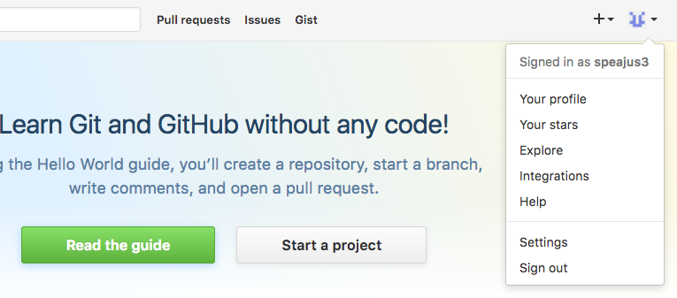
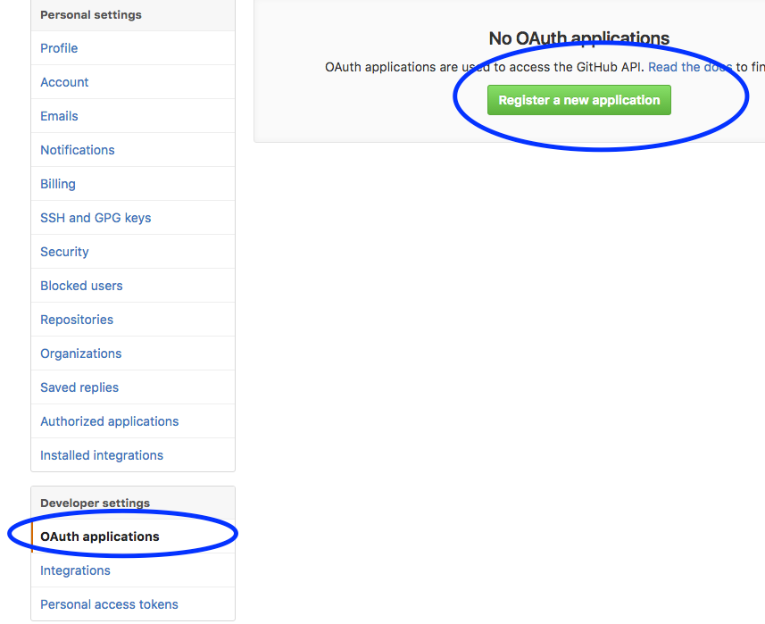
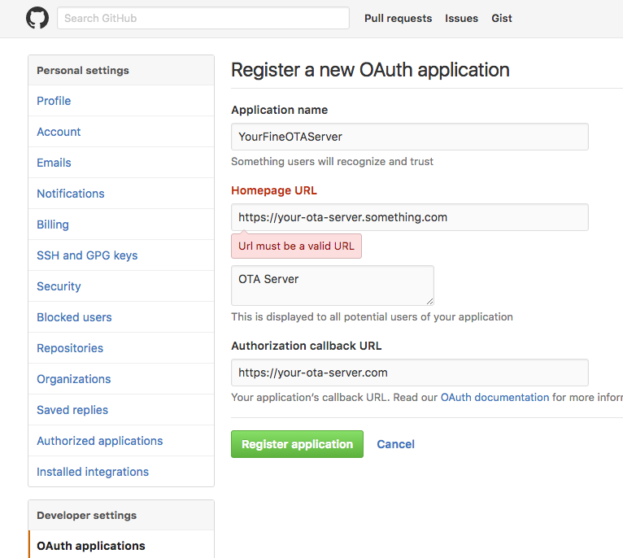
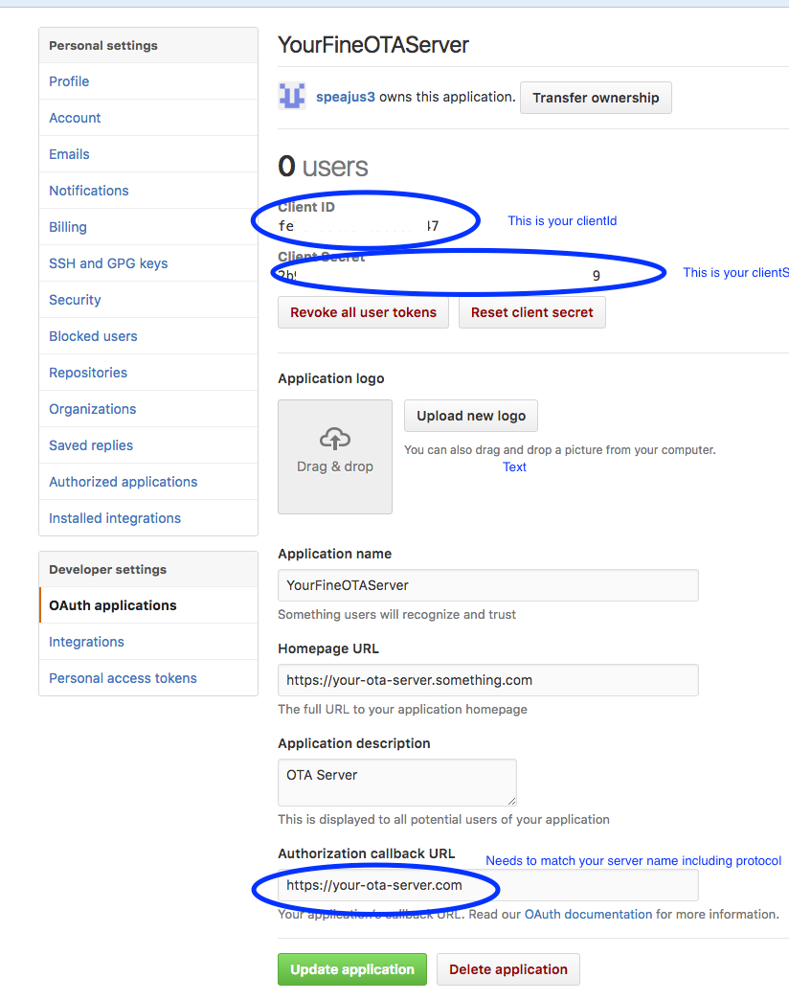

Electrode OTA Server
===
The Electrode OTA Server provides a server to allow hot deploy to android and ios React Native and Cordova apps.   The server 
is API compatible with [code-push-cli](https://microsoft.github.io/code-push/docs/cli.html), the 
[Code Push React Native SDK](https://microsoft.github.io/code-push/docs/react-native.html) and the [Code Push Cordova SDK](https://microsoft.github.io/code-push/docs/cordova.html).


### Prerequisites

* Node v6 or greater.
* Github Account (if using github as auth provider)
* Apache Cassandra - You can download [here].

### Running Cassandra
Books have been written about running and configuring cassandra, this is just the most minimal way you can run
it.  Please read such books before running this server on a public network.
```sh
$ curl http://apache.mirrors.hoobly.com/cassandra/3.9/apache-cassandra-3.9-bin.tar.gz | tar -xvzf -
$ cd apache-cassandra-3.9/
$ ./bin/cassandra
```

### Installation
This covers a minimal way to install and run electrode-ota-server.  For most scenarios this is 
not complete.   Be sure to setup SSL, load balancing, and all the other requirements for your environment.
```
  $ mkdir your_ota
  $ cd your_ota
  $ npm init
  $ npm install electrode-ota-server --save
  $ mkdir config

```
In package.json add

By default the server will start with production config.  This can be overridden with NODE_ENV.

```json
"scripts":{
  "start":" node node_modules/.bin/electrode-ota-server"
}
```

### Configure
Inside the config create a config/production.json. You can configure different settings
for production,test and development.   In production please use TLS/HTTPS for the server.

```
    "app": {
        "downloadUrl": "http://<%=your_ota_server%>/storagev2/",
        "electrode": true
    },
    "plugins": {
        
        "electrode-ota-server-dao-cassandra": {
            "options": {
                "contactPoints": [
                    //You can enter an array of cassandra "contactPoints" but you need at least one.
                    // If you are running cassandra locally you can use "localhost".
                    "<%=cassandra.hosts%>"
                ],
                //Optional username and password.  If you are connceting to a cassandra instance that
                // requires them.
                "username": "<%=cassandra.username%>",
                "password": "<%=cassandra.password%>"
                //Optional the keyspace you want to run the server with. 
                "keyspace":"<%=cassanra.keyspace%>
            }
        },
        //This allows for other fileservice mechanisms to be plugged in.  Currently the files are stored
        // in the cassandra db, but the could be stored in anything really, including the filesystem.
        "electrode-ota-server-fileservice":{
              "options": {
                //this needs to be the url of your acquistion server.  It can be the same as your current
                // management server.  This value is just an example.
                "downloadUrl": "http://<%=your_ota_server%>/storagev2/"
              }
        },
        "electrode-ota-server-auth": {
            "options": {
                "strategy": {
                    //Authentication Strategy.  The OTA uses [bell](http://https://github.com/hapijs/bell) for
                    //OAuth.  You can see the vendors and options there.  We test with github oAuth.
                
                    "github-oauth": {
                        "options": {
                            //A Cookie password otherwise a raondom one (Optional)
                            "password":"<%= another cookie password%>",
                             //This is true by default if not running https change to false.   You should run over https though
                            "isSecure":true,
                            //The callback hostname of your server.   If you are running behind a proxy,
                            //it may be different than what the server thinks it is. (Optional)
                            "location":"<%= the address of your server %>",
                            //Get the Oauth info from github.
                            "clientId": "<%=github oauth clientId%>",
                            "clientSecret": "<%=github oauth clientSecret%>"
                        }
                    },
                   "session": {
                        "options": {
                            //A Cookie password otherwise a raondom one (Optional)
                            "password":"<%= another cookie password%>",
                             //This is true by default if not running https change to false.   You should run over https though
                            "isSecure":true
                        }
                   }
                    
                }
            }
        },
    }


```


### Setting up OAuth
To use github as an OAuth provider you need to login to github and add an OTA Application.

Step 1 - Login to github and select Settings.


Step 2 - Go to "Developer Settings" and select "OAuth applications"


Step 3 - Setup your application.   Keep in mind protocols and urls are important.  Also you can set up a key for development also (localhost.yourdomain.com).
Make sure that resolves, for your machine, try adding it to your hosts file.


Step 4 - Wild celebration, or double check that everthing is correct.  This is your you get your clientId and clientSecret.
Keep your clientSecret secret (avoid checking it into public github for example).



### Starting

```sh
 $ npm start
```

## Client Modification.
To use the server you just set up you will need to make the following modifications to your client app, along
with setting up Apps with the OTA Server. To configure your clients to use the new code push server login with


### Register 
You only need/can register once per github account.  So the first time each user would need to:
```sh
 $ code-push register https://<%=your_ota_server%>
```

### Login
After you have registered and you've logged out you may need to log back in.
```sh
 $ code-push login https://<%=your_ota_server%>
```

### For IOS
Then add the following to ios/<%=your_app_name%>/Info.plist. You can open this in XCode and use that instead.

```xml
    <key>CodePushServerURL</key>
    <string>http://<%=your_ota_server%></string>
```


### For Android
Then modify  android/app/src/main/java/com/<%=your_app_name%>/MainApplication.java
```java
    /**
     * A list of packages used by the app. If the app uses additional views
     * or modules besides the default ones, add more packages here.
     **/
    @Override
    protected List<ReactPackage> getPackages() {
        return Arrays.<ReactPackage>asList(
                new MainReactPackage(),
                new CodePush("<%=your_ota_deployment_key%>", this, BuildConfig.DEBUG, "<%=your_ota_server%>")
        );
    }

```
